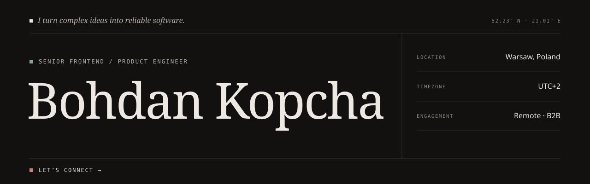
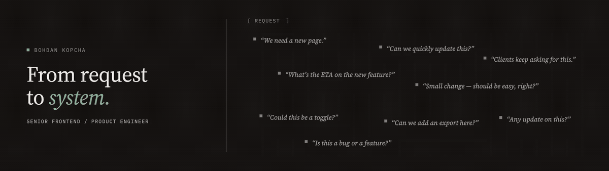

<picture>
  <source media="(prefers-color-scheme: dark)" srcset="./assets/hero.svg">
  
</picture>

 

## About

I turn complex ideas into reliable software.

Senior Frontend / Product Engineer with **6+ years of commercial experience in fintech**. I build product interfaces and frontend systems for complex workflows, with attention to information architecture, interaction quality, performance, accessibility, and maintainable delivery.

### Have a product challenge worth solving?

If you are building a new product, untangling a difficult workflow, or need a frontend partner who cares about both the product and the system behind it, let’s talk. I am open to remote B2B collaboration and meaningful engineering conversations.

**[Connect on LinkedIn](https://www.linkedin.com/in/bohdan-kopcha-478ab7314/)** &nbsp;·&nbsp; **[Email me](mailto:kopchabogdan@gmail.com)** &nbsp;·&nbsp; **[Call or message me](tel:+48508136641)**

 

---

## From request to system

### Clarity is a product feature.

A good interface does more than look polished. It helps people understand what matters, make confident decisions, and move through complex work without unnecessary friction.

 

---

## Working with

  
  &nbsp;&nbsp;
  
  &nbsp;&nbsp;
  
  &nbsp;&nbsp;
  
  &nbsp;&nbsp;
  
  &nbsp;&nbsp;
  
  &nbsp;&nbsp;
  

**Crafting interfaces** with React, Next.js, TypeScript, Vue.js, Angular, and Tailwind CSS.

**Building dependable product systems** through component architecture, design systems, accessibility, performance, and thoughtful UI quality.

**Shipping with confidence** using Node.js, GraphQL, Playwright, GitHub workflows, code review, and developer tooling.

 

---

## How I approach product work

🧭 **Understand the workflow first.** Good implementation starts with the people, decisions, and constraints behind the interface.

✨ **Make complexity feel calm.** The goal is not fewer features; it is a product that makes the right next step obvious.

⚖️ **Balance product intent and engineering reality.** Design quality, accessibility, performance, and maintainability have to work together.

🔎 **Improve the system, not only the screen.** I aim to leave the codebase, team workflow, and product experience clearer than I found them.

 

---

## Credential

### Claude Certified Architect — Foundations

Certified in designing effective Claude-powered solutions and agentic workflows.
